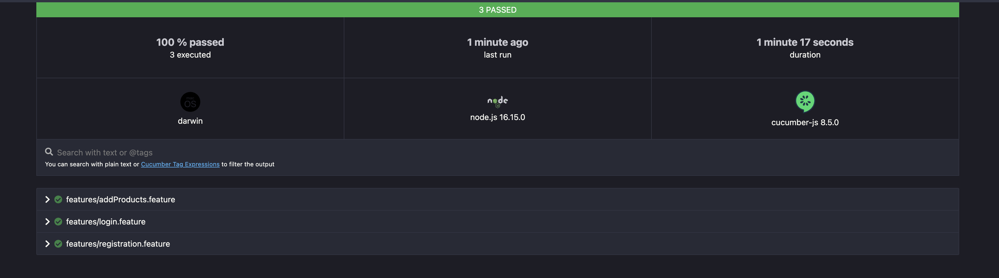

# Challenge QA

Este es un proyecto de pruebas automatizadas de la pagina web https://staging-zapatoca.miaguila.com/, los cuales se encuantran desarrollados por Claudio Rodolfo Garcete, principalmente con Selenium y Cucumber. Los test se ejecutan de manera local.

## Comenzando

Estas instrucciones te permitirán obtener una copia del proyecto en funcionamiento en tu máquina local para propósitos de desarrollo y pruebas.

### Pre-requisitos


Es necesario tener instalado [node](https://nodejs.org/en/download/) para instalar y ejecutar el ciclo de vida del proyecto.


### Instalacion

- Clonar el proyecto - `https://github.com/garceteclaudio/challenge-qa.git`.

- Para utilizar el proyecto, se debe abrir una consola bash, situarnos en el directorio raiz del proyecto /challengeQA e instalar las dependencias de la siguiente manera:


```
npm install
```


### Ejecutando las pruebas

Las pruebas son ejecutadas localmente.

- Ubicacarse en la raiz del proyecto /challengeQA

- Ejecutar el siguiente script:

```
./node_modules/.bin/cucumber-js
```

### Reporte de pruebas

- Abrir el archivo cucumber-report.html


## Video demo

[](https://www.youtube.com/watch?v=U52aAa9VkEk&list=RDU52aAa9VkEk&start_radio=1 "Testing")


## Construido con
* [Selenium Webdriver](https://www.selenium.dev/downloads/) - Framework E2E utilizado
* [Cucumber](https://cucumber.io/docs/cucumber/) - Framework para escribir los escenarios de prueba en lenguaje GHERKIN
* [NPM](https://www.npmjs.com/) - Manejador de dependencias

## Autor
* **Claudio Rodolfo Garcete** - *Automation Tester* 

## Consultas
* garcete.claudio@gmail.com